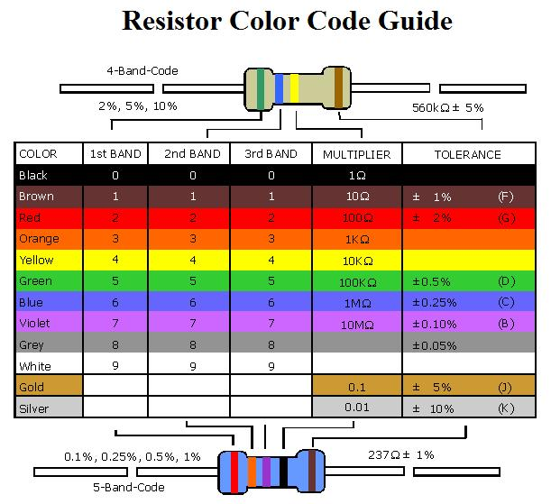

# [AZ Treasure Hunt 2018](https://www.aztreasurehunt.org)

## Useful Links
* [Tips Tricks and Otherwise](https://static1.squarespace.com/static/5897cdaf1b10e38edfed6ea7/t/5b7e143d1ae6cf17cbdc83dc/1534989374343/TipsTricksandOtherwise2018.pdf)
* [Rules](https://static1.squarespace.com/static/5897cdaf1b10e38edfed6ea7/t/5b7e152f032be4c7d39eed83/1534989616522/Rules2018.pdf)
* [HWOW](https://static1.squarespace.com/static/5897cdaf1b10e38edfed6ea7/t/5babdf0c53450a86072ac35c/1538093602573/hwow2018.pdf)

## HWOW

### Word stuff
* Mapping clue (Same characters)
  * antonyms with the same letters
    * epitaphs <≠> happiest
    * inferno <≠> nonfire
  * syntonyms with the same letters
    * it’s <=> ‘tis
    * aye <=> yea
* This clue: ?
   * stuBBorNNeSS
   * miLLeNNiaLLy
* `llab gnilwob eht ...llab eht htiw lwarC` . -> Crawl with the ball.. the bowling ball (backwards?)
* `itz BASE ick AIR RIFF MEDIC` -> Its basic Arithmetic
* `Autoantonyms: Should we sanction their use <?> or sanction those who use them?`

### Numbers, Physics, Codes
* Number repeated along the border: 655321
* Circuits [Series vs Parallel](https://physics.bu.edu/py106/notes/Circuits.html)

    * 203, 453, 683, 183
* [Scytale](https://en.wikipedia.org/wiki/Scytale) Ribbon wrapped around a poll. [Decoder](https://www.dcode.fr/scytale-cipher)
  * Colors used: Brown, Green, Red
* Morse code `MORSECODE`
[Table](https://morsecode.scphillips.com/morse2.html) & [Translator](https://morsecode.scphillips.com/translator.html)

### Trivia stuff?
* [Using the big dipper to find the north star](http://earthsky.org/tonight/use-big-dipper-to-find-polaris-the-north-star)
* `If you would ONLY LISTEN TO THE PASSENGER!` ?
* [Georg Cantor](https://en.wikipedia.org/wiki/Georg_Cantor) died 100 years ago
  * [degrees of infinity](https://thatsmaths.com/2014/07/31/degrees-of-infinity/)
* (Firefighters lost in Wildfire)[https://www.cbsnews.com/news/shock-over-loss-of-19-ariz-firefighters-in-wildfire/]
* (Pheidippides)[https://en.wikipedia.org/wiki/Pheidippides],  marathon race. run from Marathon to Athens to deliver news of a military victory against the Persians at the Battle of Marathon.
* (House of Cards, TV Series)[https://en.wikipedia.org/wiki/House_of_Cards_(U.S._TV_series)]
* [Time Magaizne](https://en.wikipedia.org/wiki/Time_(magazine))

